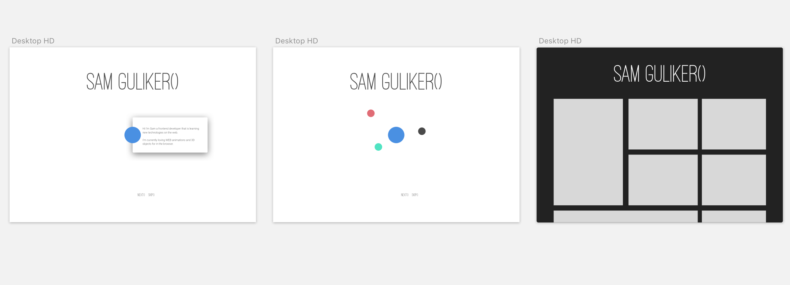

# Webdesign portfolio
`this` website will contain HCI, IA , Inclusive and Exclusive design.

# Table of Content
- [Content](#content)
- [User case and goals](#user-case-and-goals)
- [Card sorting](#card-sorting)
- [Design](#design)
- [Checklist](#checklist)

# Content
Important pieces of my content within my portfolio will be around me(narcissistic).

### About me
The content will contain.
- Who I am
- What I'm currenlty focussing on
- My passions

### My work
I will use filter options which will be ambiguous and exact. For ambiguous I will make thema's such as design and frontend. And for exact I will use chronological.

- Design
- Frontend
- Experiments

# User case and goals
## First user case
**Usercas**: Larrissa is a 24 year old paralympic champion and accessibility professional.  
Her eye sight is not so strong, she can only see a few percent with her eyes.  
She uses headlines to make sure she can find what she needs.

**Goal**: I want to make sure this website is full accessibility proof.

**Pleasureable**: I tried to find out what pleasurable ment for her.  
She replied with that it needs to be functional. I'm not sure  what to do with this, I'm going to try and make some  word jokes inside my website and try to make it more pleasurable `this` way.

## Second user case
**Usercase**: Senior developer at an internship.  
I think its important to make sure who I am and what my  passions are, and obviously my work.

**Goals** : To show the Senior developer who I am and what kind of passions I have.

**Pleasureable**: I want to make sure I have some nice animations that will be pleasing for the eyes

# Card sorting
With card sorting I make sure the structure is on :fire:

**Home**:
I want to make sure there is a small introduction about me.

**About me** This will contain my passions and hobbies.
**Work** This will contain my work and experimental frontend work.

# Design
My design still needs some fine-tuning
I got my base setup.

# Checklist
- [ x ] Design
- [ ] Filter
- [ ] Small Details
